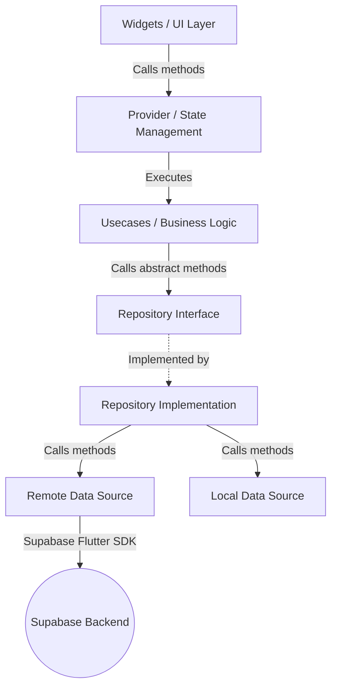

# Campus-Connect: Frontend & Backend Viva Preparation Guide

This guide is designed to prepare you for your oral exam (viva). It explains the clean architecture patterns in your Flutter frontend, the role of every structural layer, and how it integrates with the backend logic.

---

## 1. Clean Architecture & Code Organization (Frontend)

Campus-Connect uses **Clean Architecture** combined with the **Feature-First** approach. Each feature in the `lib/features/` folder is divided into three distinct layers: **Presentation**, **Domain**, and **Data**. 

Here is what each layer does, the code it contains, and **why** it is designed this way.

### ── The Presentation Layer
This layer is responsible for how things look and how user input is captured.
*   **Widgets (UI / Views):** Pure Flutter widgets (e.g., `feed_header.dart`). They shouldn't contain any logic. Their job is simply to display UI based on state and trigger callbacks when users click buttons.
*   **Providers (State Management):** Classes extending `ChangeNotifier` (e.g., `AuthProvider`, `FeedProvider`, `ThreadProvider`). 
    *   **What they do:** They manage UI state (e.g., showing a loading indicator, displaying an error message, storing fetched feeds). 
    *   **How they work:** When the UI triggers an action (like calling `login()`), the Provider calls the relevant Use Case, updates its internal state (`isLoading = true`), and calls `notifyListeners()`. The UI rebuilds automatically to show the change.

### ── The Domain Layer (The Core)
This is the most important layer. It contains the **pure business logic** of your application and is written in pure Dart—it doesn't depend on Flutter, widgets, or any database package (not even Supabase).
*   **Entities:** Core business data objects. They represent real-world concepts (e.g., `User`, `Post`). They are simple, immutable Dart classes.
*   **Use Cases:** Single-responsibility classes that perform one specific business action (e.g., `SubmitPostUsecase`, `JoinCarpoolRideUsecase`).
    *   **Why have them?** They represent the "rules" of the app. By splitting actions into single-responsibility classes, your code is modular, self-documenting, and extremely easy to unit-test.
*   **Repository Interfaces (Abstract Classes):** These define the **contract** for what data operations are allowed (e.g., `abstract class AuthRepository`).
    *   **Why have them?** This is called **Dependency Inversion**. The domain layer *demands* certain data actions but doesn't care *how* they are completed (whether via SQL, Supabase, Firebase, or mockup files).

### ── The Data Layer (The Implementation)
This layer handles the actual retrieval and storage of data. It depends on external packages (like `supabase_flutter` or `shared_preferences`).
*   **Models:** Subclasses of Entities that add data parsing logic. They contain `fromJson()` and `toJson()` constructors to convert raw data from Supabase into typed Dart objects.
*   **Repository Implementations:** Concrete classes that implement the Repository contracts from the Domain layer (e.g., `AuthRepositoryImpl`).
    *   **What they do:** They orchestrate data flow. They call the Data Sources, catch raw errors, map models back into entities, and return them to the domain layer.
*   **Data Sources (Remote & Local):** The actual bridges to storage.
    *   **Remote Data Source (e.g., `AuthRemoteDataSourceImpl`):** Directly makes calls to the Supabase database using the SDK.
    *   **Local Data Source (e.g., `OnboardingLocalDataSourceImpl`):** Manages local client storage (like using `shared_preferences` to remember if a user has completed the onboarding flow).

---

## 2. Feature-by-Feature: Frontend to Backend Mapping

Here is how each major feature works. We map the **Frontend Code components** directly to the **Backend Logic (triggers, security rules, and constraints)** that execute the feature.

---

### Feature A: Authentication & Profile Setup
Handles user registration, login, profile customisation, and `.edu` email requirements.

*   **Frontend UI & Provider:** 
    *   `AuthProvider` coordinates auth states.
    *   `ProfileSetupProvider` stores lists of universities, departments, and semesters.
*   **Frontend Use Cases:** 
    *   `LoginUsecase`, `SignupUsecase`, `SaveProfileUsecase`.
*   **Frontend Data Layer:** 
    *   `AuthRemoteDataSourceImpl` makes direct calls to Supabase Authentication using:
        `SupabaseService.auth.signInWithPassword(...)` or `signUp(...)`.
*   **Backend Logic (Supabase Triggers & Security Code):**
    *   **Edu Email Validation:** Enforced at the database layer via a CHECK constraint (`email_must_be_edu`). If a user attempts to save a profile with a non-`.edu` email address, the backend rejects it.
    *   **Auto-profile Creation Trigger (`on_auth_user_created`):** When a user successfully registers an account via Supabase Auth, the backend automatically fires a trigger function `public.handle_new_user()`. This function copies their new `id`, `email`, and `full_name` over to create an entry in the `public.profiles` database.
    *   **Security (RLS Policy):** Enforces that a user can view other user profiles if authenticated, but they can only execute updates on their **own** profile row (`auth.uid() = id`).

---

### Feature B: Social Feed & Thread Interaction
Enables student social posts, nested commenting, upvoting/downvoting posts, and calculating score counters.

*   **Frontend UI & Provider:** 
    *   `FeedProvider` (displays the list of posts).
    *   `CreatePostProvider` (manages drafts and uploads).
    *   `ThreadProvider` (manages details of a single post and its replies).
*   **Frontend Use Cases:** 
    *   `GetFeedUsecase`, `SubmitPostUsecase`, `VoteOnPostUsecase`, `PostCommentUsecase`.
*   **Frontend Data Layer:**
    *   `FeedRemoteDataSourceImpl` fetches posts using `.select()`, filters by university, and inserts votes/posts.
*   **Backend Logic (Supabase Triggers & Security Code):**
    *   **Comment Count Trigger (`on_comment_change`):** Every time a user writes a comment on a post, the backend executes `public.handle_comment_count()`. This automatically updates the post's counter (+1 on comment creation, -1 on comment deletion) to keep feed previews fast and in sync.
    *   **OP Identifier Trigger (`on_comment_set_op`):** When a comment is created, a trigger checks if the comment's author is the creator of the post. If true, it automatically tags the comment as `is_op = true` (Original Poster) at the server level.
    *   **Vote Counter Sync Trigger (`on_post_vote_change` & `on_comment_vote_change`):** Automatically recalculates/syncs upvote and downvote metrics on the `posts` and `comments` table whenever a new vote record is inserted, updated (switching from upvote to downvote), or deleted.
    *   **Security (RLS Policies):** 
        *   "Users can insert posts in their own university" blocks users from publishing posts into university campuses they don't belong to.
        *   "Users can insert comments in their own university posts" locks discussion channels down to members of that specific campus.

---

### Feature C: Carpool (Ride Sharing)
Allows drivers to post commutes and passengers to join/leave rides while updating available seats.

*   **Frontend UI & Provider:** 
    *   `CarpoolProvider` (updates lists of rides and processes registrations).
*   **Frontend Use Cases:** 
    *   `GetCarpoolRidesUsecase`, `JoinCarpoolRideUsecase`.
*   **Frontend Data Layer:** 
    *   `CarpoolRemoteDataSourceImpl` fetches rides from `carpool_rides` and writes registrations into `carpool_passengers`.
*   **Backend Logic (Supabase Triggers & Security Code):**
    *   **Seat Manager Trigger (`on_passenger_change`):** When a user joins a carpool, their registry is added to `carpool_passengers`. The backend trigger `public.handle_carpool_seats()` catches this insert and increments `taken_seats` on the ride listing. When they leave, it decrements the count.
    *   **Driver Karma Boost Trigger (`on_ride_created_karma`):** Every time a driver lists a ride to help out, the backend executes `public.handle_ride_karma()`, which instantly adds `5` to their profile's `karma_score`.
    *   **Integrity Checks:** 
        *   A database check constraint (`seats_check`) guarantees that `taken_seats` is always a positive number and never exceeds `total_seats`.
        *   A unique constraint (`unique_ride_passenger`) ensures a user cannot join the same ride twice.
    *   **Security (RLS Policies):** Drivers can delete or modify their own rides (`auth.uid() = driver_id`), whereas passengers can join or leave rides by inserting/deleting their own passenger records.

---

### Feature D: Notifications System
Delivers in-app alerts for comments, carpools, and marketplace actions.

*   **Frontend UI & Provider:** 
    *   `NotificationsProvider` holds list models and handles mark-as-read states.
*   **Frontend Use Cases:** 
    *   `GetNotificationsUsecase`, `MarkAllReadUsecase`.
*   **Frontend Data Layer:** 
    *   `NotificationsRemoteDataSourceImpl` reads from `notifications` and updates `is_read` parameters.
*   **Backend Logic (Supabase Triggers & Security Code):**
    *   **Auto-Notify Trigger (`on_comment_notify`):** When a comment is successfully posted, the backend runs `public.notify_on_comment()`. This function identifies the author of the post, verifies it's not the commenter themselves, and automatically generates a notification record.
    *   **Comment Karma Boost:** Inside the same trigger, the post author is awarded `1` karma point in their profile record for receiving engagement.
    *   **Security (RLS Policy):** "Users can view own notifications" policy restricts selects and updates to the specific user (`auth.uid() = user_id`). Users cannot read or delete notifications belonging to anyone else.

---

## 3. Core Architectural Highlights (Perfect for Viva answers!)

If the examiner asks you complex technical questions, use these explanations:

### 1. State Management & Realtime Sync
*   **How Provider Works:** We use `ChangeNotifierProvider` to instantiate our providers at the top of the widget tree (in `main.dart`). UI widgets use `context.watch<FeedProvider>()` to listen to changes. When the provider gets new data, it calls `notifyListeners()`, which prompts only the registered widgets to redraw.
*   **Realtime Subscriptions:** Supabase utilizes **PostgreSQL Replication** via its Realtime service. Tables (like `posts`, `comments`, and `notifications`) have Realtime enabled in migrations. This enables the Flutter frontend to listen to stream-like changes directly from the database and update the UI live.

### 2. Route Protection and Onboarding Flow
*   **GoRouter Integration:** We pass our `AuthProvider` directly into the routing config. GoRouter listens to `AuthProvider`'s login state. If a user tries to access the home screen but is unauthenticated, GoRouter intercepts the request and redirects them to the Login screen. If they have authenticated but have not completed onboarding, they are routed to the Onboarding / Profile Setup page first.
